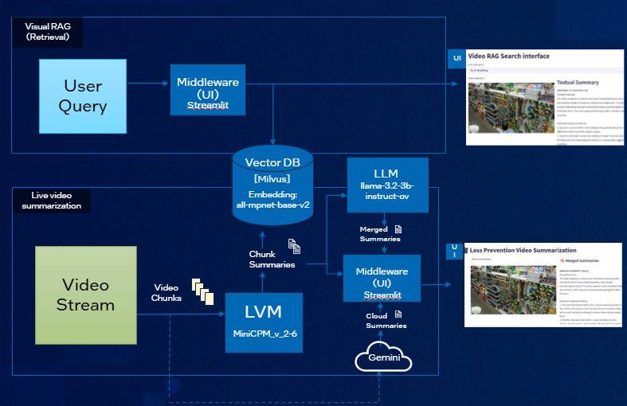

# Summarize Videos Using OpenVINO-GenAI, Langchain, and MiniCPM-V-2_6



## If you would like to store chunk summaries in a vector DB for later search and retrieval, then setup Milvus DB as a standalone Docker container
```
chmod +x ./milvus/setup.sh
./milvus/setup.sh
```
Verify the service is running using `docker ps`

## If you would like to inference anomalous clips to gemini cloud model, then setup gcloud instance
Follow [link](https://cloud.google.com/sdk/docs/install) to create google cloud account and install gcloud.

Next, login and authenticate your account
```
# Initialize gcloud and create login credentials. Tip: Save path to .json credential file.
gcloud init

# Use credentials to login and authorize account
gcloud auth application-default login 
```

## Convert and Save Optimized MiniCPM

1. Then, follow the steps on the [MiniCPM-V-2_6 HuggingFace Page](https://huggingface.co/openbmb/MiniCPM-V-2_6) to gain
access to the model. For more information on user access tokens for access to gated models
see [here](https://huggingface.co/docs/hub/en/security-tokens).
2. Next, install Intel Client GPU, Conda, Set Up Python Environment and Create OpenVINO optimized model for MiniCPM

```
# Installation (Validated on Ubuntu 24.04 and 22.04)
./install.sh
```

Note: if this script has already been performed and you'd like to re-install the sample project only, the following
command can be used to skip the re-install of dependencies. 

```
./install.sh --skip
```

## Convert and Save Optimized MiniCPM-V-2_6

This section can be skipped if you ran `install.sh` the first time. The `install.sh` script runs this command as part of 
its setup. This section is to give the user flexibility to tweak the `optimum-cli` command for certain model parameters. 

Ensure you are inside the conda environment created for this project. 
```
conda activate ovlangvidsumm
optimum-cli export openvino -m openbmb/MiniCPM-V-2_6 --trust-remote-code --weight-format int8 MiniCPM_INT8 # int4 also available
```

## Run Video Summarization

Summarize [this sample video](https://github.com/intel-iot-devkit/sample-videos/raw/master/one-by-one-person-detection.mp4)
using `video_summarizer.py`.

```
./run-demo.sh 
```

Note: if the demo has already been run, you can use the following command to skip the video download.

```
./run-demo.sh --skip
```

## How to change video and/or prompts

### Video, VLM prompt & cloud inference enbling
If you'd like to change the video being summarized, open `summarizer/streamlit_merge.py` in the IDE of your choice and to change the video path at line 118. If you would like to change the prompt the the VLM for summarization, and/or enbaling the use of gemini for cloud inferenece, navigate to lines 206-227.

### LLM merger prompt
Note: If you'd like to change the prompt to the merger model, open `merger/summary_merger.py` and change the prompt at line 27.

### Cloud model prompt
Note: If you'd like to change the prompt to the cloud model open `summarizer/streamlit_summarizer.py` and change the prompt at line 266. 
